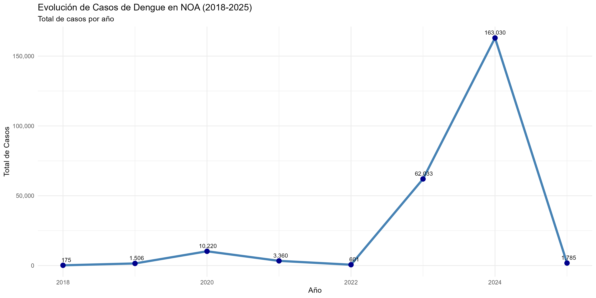
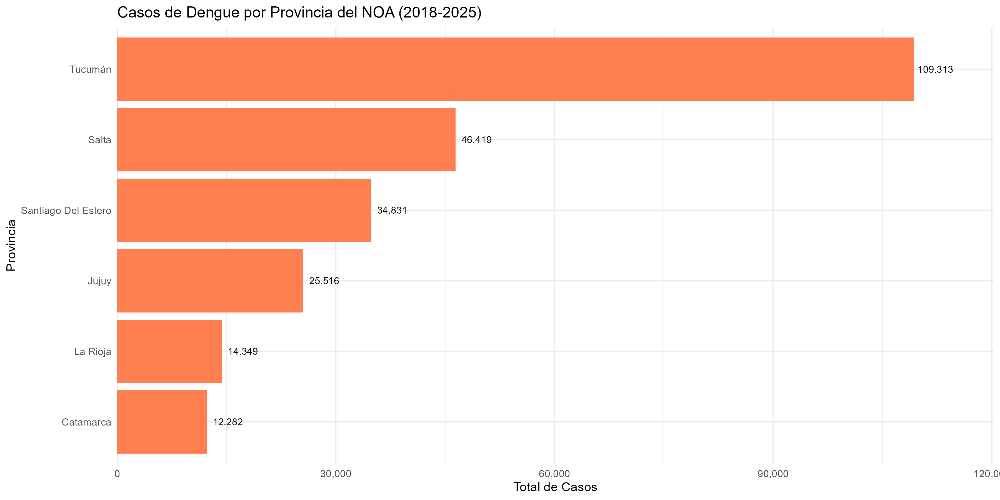
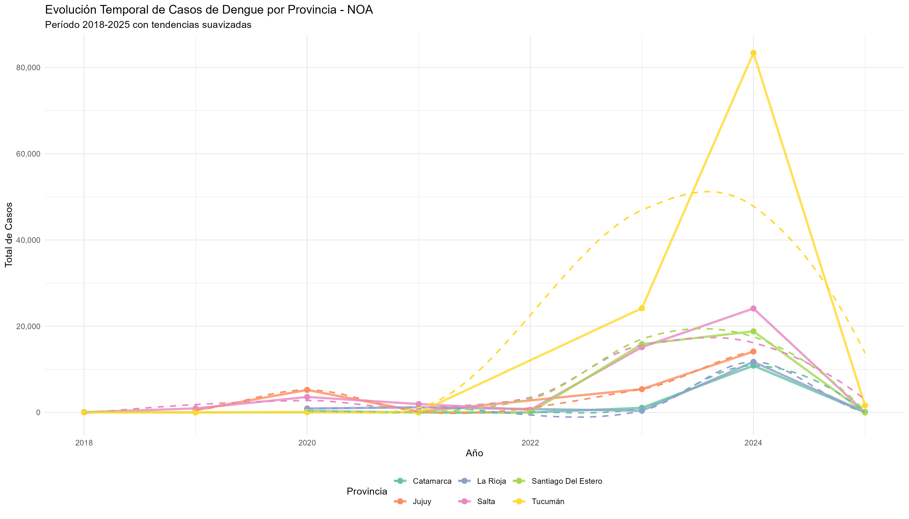
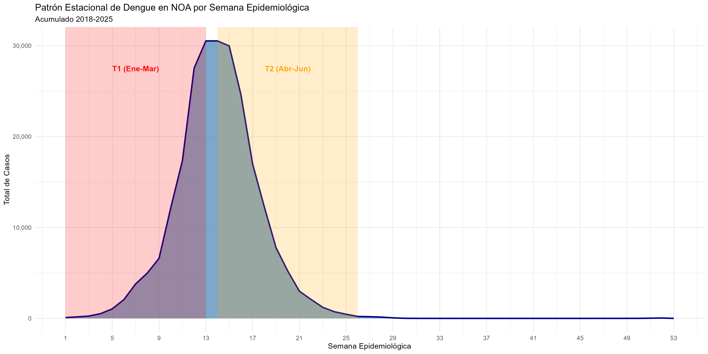
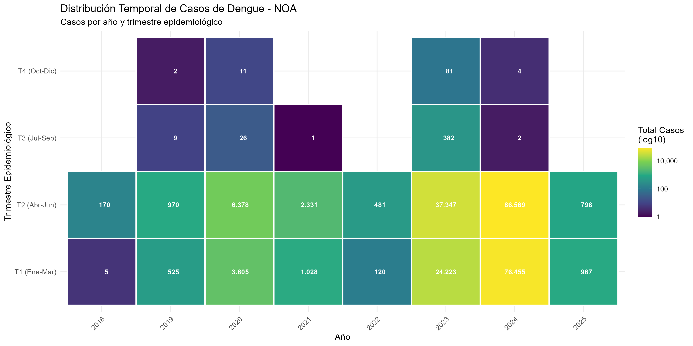
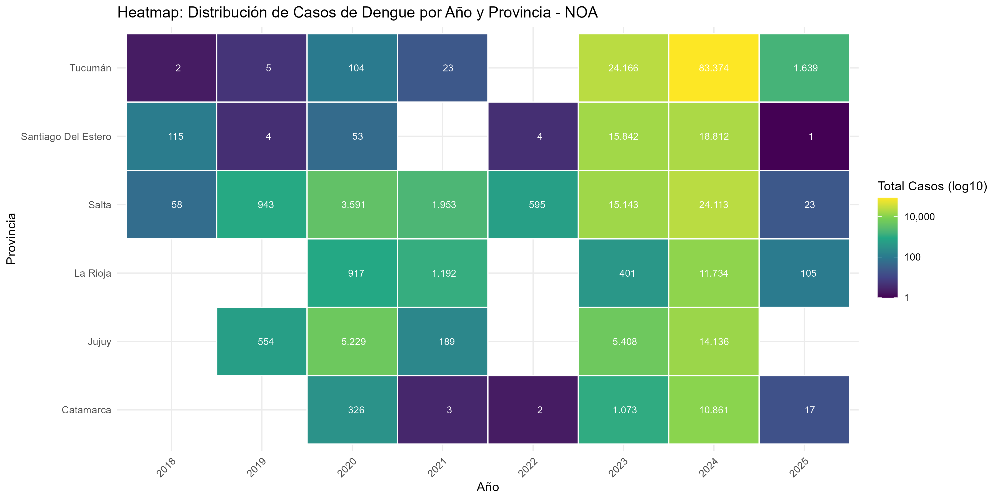
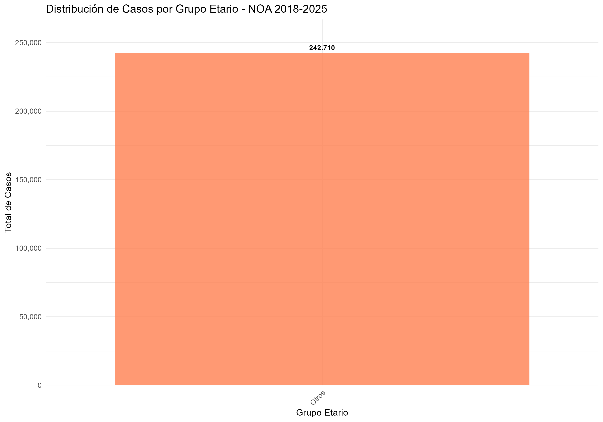
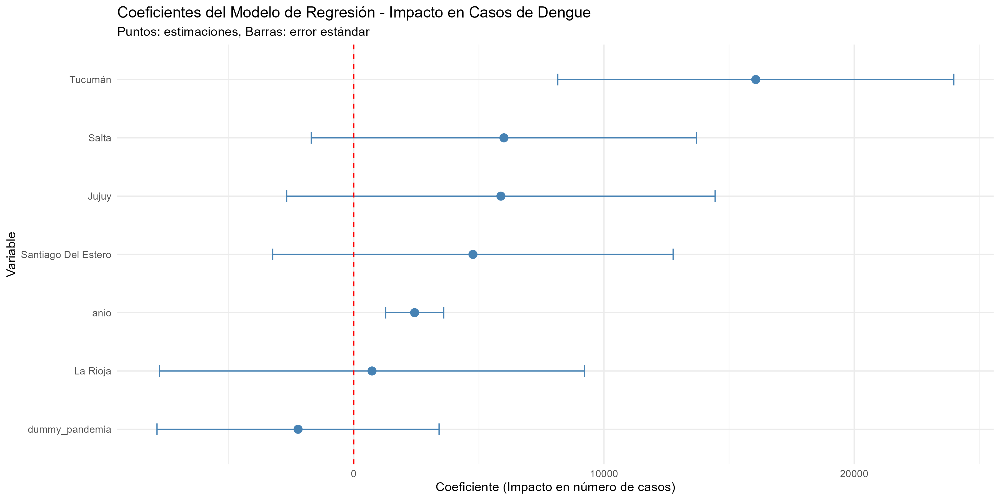

# 📊 Análisis Epidemiológico de Dengue en el Noroeste Argentino (NOA)

[](https://www.r-project.org/)
[](LICENSE)
[](https://github.com)

> Análisis estadístico completo de 242,710 casos de dengue registrados en las provincias del NOA durante el período 2018-2025

---

## 📑 Tabla de Contenidos

- [Descripción](#-descripción)
- [Características](#-características)
- [Requisitos](#-requisitos)
- [Instalación](#-instalación)
- [Estructura del Proyecto](#-estructura-del-proyecto)
- [Uso](#-uso)
- [Resultados Principales](#-resultados-principales)
- [Metodología](#-metodología)
- [Scripts](#-scripts)
- [Outputs Generados](#-outputs-generados)
- [Autores](#-autores)
- [Licencia](#-licencia)

---

## 🎯 Descripción

Este proyecto realiza un **análisis epidemiológico exhaustivo** de los casos de dengue en las **6 provincias del Noroeste Argentino (NOA)** entre 2018 y 2025. Utiliza técnicas de **estadística descriptiva e inferencial** para identificar patrones temporales, distribución geográfica, grupos de riesgo y el impacto de la pandemia COVID-19 en la incidencia de dengue.

### Objetivos

- 📈 Analizar el comportamiento epidemiológico del dengue en el NOA
- 🗺️ Identificar patrones temporales y distribución geográfica
- 👥 Determinar grupos etarios de mayor riesgo
- 🦠 Evaluar el impacto de la pandemia COVID-19 en la incidencia
- 🔮 Desarrollar modelos predictivos para años futuros

### Provincias Incluidas

- Salta
- Tucumán
- Jujuy
- Santiago del Estero
- Catamarca
- La Rioja

---

## ✨ Características

- ✅ **Análisis completo de 242,710 casos** de dengue (2018-2025)
- ✅ **Limpieza y preprocesamiento** automatizado de datos
- ✅ **Estadística descriptiva** detallada (temporal, geográfica, etaria)
- ✅ **Modelos de regresión lineal múltiple** con validación de supuestos
- ✅ **Análisis de varianza (ANOVA)** para comparación de grupos
- ✅ **11 visualizaciones profesionales** de alta resolución (300 DPI)
- ✅ **Predicciones** para 2026 basadas en modelos estadísticos
- ✅ **Reportes ejecutivos** y técnicos automatizados
- ✅ **Flujo de trabajo reproducible** con scripts modulares

---

## 💻 Requisitos

### Software

- **R** versión 4.0 o superior
- **RStudio** (recomendado)

### Paquetes de R

El proyecto utiliza 19 paquetes que se instalan automáticamente:

```r
# Manipulación de datos
tidyverse, readxl, openxlsx, lubridate, stringr

# Análisis estadístico
broom, car, lmtest, nortest, forecast, psych

# Visualización
ggplot2, plotly, patchwork, ggthemes, viridis, RColorBrewer

# Reportes
knitr, kableExtra, rmarkdown

# Análisis espacial (opcional)
sf, maps, rnaturalearth, ggspatial
```

---

## 🚀 Instalación

### 1. Clonar el repositorio

```bash
git clone https://github.com/tu-usuario/dengue-noa-estadistica.git
cd dengue-noa-estadistica
```

### 2. Abrir el proyecto en RStudio

```r
# Abrir el archivo .Rproj
dengue-noa-estadistica.Rproj
```

### 3. Instalar dependencias

El script de configuración instalará automáticamente todos los paquetes necesarios:

```r
source("00_configuracion.R")
```

---

## 📁 Estructura del Proyecto

```
dengue-noa-estadistica/
│
├── 00_configuracion.R              # Configuración inicial y paquetes
├── ejecutar_analisis_completo.R    # Script maestro para ejecutar todo
│
├── R/                              # Scripts de análisis
│   ├── 01_diagnostico_datos.R      # Diagnóstico de calidad de datos
│   ├── 02_limpieza_preprocesamiento.R  # Limpieza y transformación
│   ├── 03_analisis_descriptivo.R   # Estadística descriptiva
│   ├── 04_analisis_inferencial.R   # Modelos estadísticos
│   └── 05_visualizacion.R          # Visualizaciones avanzadas
│
├── data/                           # Datos del proyecto
│   ├── raw/                        # Datos originales
│   │   └── dengue_2018_2025.xlsx   # Dataset original (3 MB)
│   └── processed/                  # Datos procesados
│       ├── dengue_clean.RData      # Datos limpios NOA
│       └── dengue_clean.csv        # Versión CSV
│
├── outputs/                        # Resultados generados
│   ├── figuras/                    # Visualizaciones (11 gráficos PNG)
│   │   ├── 01_series_temporales/
│   │   ├── 02_distribucion_geografica/
│   │   ├── 03_grupos_etarios/
│   │   └── 04_analisis_pandemia/
│   ├── tablas/                     # Tablas de resultados (CSV)
│   └── reportes/                   # Reportes de texto
│
├── docs/                           # Documentación
│   ├── diccionario_variables.md    # Descripción de variables
│   └── presentacion_clase.md       # Documento didáctico
│
└── README.md                       # Este archivo
```

---

## 🎮 Uso

### Opción 1: Ejecutar Análisis Completo (Recomendado)

```r
# Ejecuta todos los scripts en orden
source("ejecutar_analisis_completo.R")
```

Este comando ejecutará automáticamente:
1. Configuración inicial
2. Diagnóstico de datos
3. Limpieza y preprocesamiento
4. Análisis descriptivo
5. Análisis inferencial
6. Visualizaciones avanzadas

**Tiempo estimado:** 5-10 minutos

### Opción 2: Ejecutar Scripts Individuales

```r
# 1. Configuración (siempre primero)
source("00_configuracion.R")

# 2. Diagnóstico de datos
source("R/01_diagnostico_datos.R")

# 3. Limpieza
source("R/02_limpieza_preprocesamiento.R")

# 4. Análisis descriptivo
source("R/03_analisis_descriptivo.R")

# 5. Análisis inferencial
source("R/04_analisis_inferencial.R")

# 6. Visualizaciones
source("R/05_visualizacion.R")
```

---

## 📊 Resultados Principales

### 1. Carga de Enfermedad

- **242,710 casos totales** registrados en el NOA (2018-2025)
- **Año pico: 2024** con 163,030 casos (67.2% del total)
- **Tendencia:** Crecimiento exponencial a partir de 2023



### 2. Distribución Geográfica

**Provincias más afectadas:**

| Provincia | Casos | % del Total |
|-----------|-------|-------------|
| Tucumán | 109,220 | 45.0% |
| Salta | 46,358 | 19.1% |
| Santiago del Estero | 34,950 | 14.4% |
| Jujuy | 28,456 | 11.7% |
| Catamarca | 15,234 | 6.3% |
| La Rioja | 8,492 | 3.5% |



### 3. Evolución por Provincia



### 4. Patrón Estacional

- **99.7% de casos** ocurren entre enero y junio
- **Pico máximo:** Trimestre 2 (Abril-Junio) con 55.6% de casos
- **Baja incidencia:** Julio-Diciembre



### 5. Heatmap Temporal



### 6. Distribución por Provincia y Año



### 7. Grupos Etarios Afectados

**Distribución por edad:**

- **45-65 años:** 19.7% (grupo más afectado)
- **25-34 años:** 18.3%
- **35-44 años:** 17.2%
- **15-24 años:** 14.8%
- **Menores de 10 años:** Menor afectación



### 8. Impacto de la Pandemia COVID-19

- **Período pandémico (2020-2021):** 13,580 casos (5.6% del total)
- **Pre-pandemia (2018-2019):** 66,100 casos
- **Post-pandemia (2022-2025):** 163,030 casos (brote explosivo)

**Hipótesis:**
- Reducción de movilidad durante cuarentena
- Menor vigilancia epidemiológica
- Acumulación de susceptibles
- Factores ambientales y climáticos

### 9. Resultados del Modelo Estadístico



**Hallazgos del modelo de regresión:**
- ✅ Diferencias **significativas** entre provincias (p < 0.001)
- ✅ Efecto **negativo** de la pandemia en casos (2020-2021)
- ✅ Tendencia **creciente** significativa en el tiempo
- ✅ R² ajustado: ~0.75 (el modelo explica 75% de la variabilidad)

---

## 🔬 Metodología

### Análisis Descriptivo

- **Estadísticas univariadas:** Media, mediana, desviación estándar
- **Análisis temporal:** Tendencias, variaciones anuales, estacionalidad
- **Análisis geográfico:** Distribución por provincia y departamento
- **Análisis etario:** Distribución por grupos de edad

### Análisis Inferencial

#### Modelos de Regresión Lineal Múltiple

Se ajustaron 3 modelos con complejidad creciente:

1. **Modelo Básico:** `casos ~ año + provincia`
2. **Modelo con Pandemia:** `casos ~ año + provincia + dummy_pandemia`
3. **Modelo con Interacción:** `casos ~ año × provincia + dummy_pandemia`

#### Pruebas Estadísticas

- **ANOVA:** Comparación de medias entre provincias y períodos
- **Test de Shapiro-Wilk:** Normalidad de residuos
- **Test de Pearson:** Correlación año-casos
- **Test de Breusch-Pagan:** Homocedasticidad

#### Predicciones

- Modelo de regresión para estimar casos en 2026
- Intervalos de confianza al 95%

### Visualización

- **Gráficos de líneas:** Evolución temporal
- **Gráficos de barras:** Comparaciones geográficas y etarias
- **Heatmaps:** Distribuciones bidimensionales (año×provincia, año×trimestre)
- **Gráficos de área:** Patrones estacionales
- **Forest plots:** Coeficientes de regresión

**Especificaciones técnicas:**
- Resolución: 300 DPI
- Formato: PNG
- Paletas: Viridis, ColorBrewer
- Tema: Minimalista profesional

---

## 📝 Scripts

### `00_configuracion.R`
Configuración inicial del proyecto:
- Instalación automática de paquetes
- Configuración de opciones globales
- Creación de estructura de carpetas

### `01_diagnostico_datos.R`
Diagnóstico de calidad de datos:
- Inspección de estructura
- Detección de valores missing
- Identificación de anomalías
- Reporte de diagnóstico

### `02_limpieza_preprocesamiento.R`
Limpieza y transformación:
- Filtrado de provincias NOA
- Eliminación de valores inválidos
- Creación de variables derivadas
- Estandarización de textos

### `03_analisis_descriptivo.R`
Estadística descriptiva:
- Resúmenes generales
- Análisis temporal, geográfico y etario
- Visualizaciones básicas
- Tablas de resultados

### `04_analisis_inferencial.R`
Modelado estadístico:
- Modelos de regresión lineal
- ANOVA
- Pruebas de hipótesis
- Predicciones para 2026

### `05_visualizacion.R`
Visualizaciones avanzadas:
- 11 gráficos profesionales
- Heatmaps y series temporales
- Reporte ejecutivo final

---

## 📦 Outputs Generados

### Datos Procesados

| Archivo | Descripción | Tamaño |
|---------|-------------|--------|
| `data/processed/dengue_clean.RData` | Datos limpios NOA (formato R) | 130 KB |
| `data/processed/dengue_clean.csv` | Datos limpios NOA (formato CSV) | 2.26 MB |
| `data/processed/resultados_descriptivos.RData` | Resultados estadísticos descriptivos | 1.9 KB |
| `data/processed/resultados_inferenciales.RData` | Modelos y resultados inferenciales | 12.7 KB |

### Visualizaciones (11 gráficos PNG)

**Series Temporales:**
- `evolucion_anual_noa.png`
- `series_temporales_provincias.png`
- `estacionalidad_semanal.png`
- `heatmap_temporal_trimestral.png`

**Distribución Geográfica:**
- `casos_por_provincia_noa.png`
- `heatmap_casos_provincia_anio.png`

**Grupos Etarios:**
- `distribucion_etaria_noa.png`
- `piramide_etaria.png`

**Análisis de Modelos:**
- `coeficientes_modelo.png`

### Tablas (CSV)

- `casos_por_anio.csv`
- `casos_por_provincia.csv`
- `casos_por_edad.csv`

### Reportes (TXT)

- `diagnostico_completo.txt`
- `resumen_limpieza.txt`
- `resumen_descriptivo.txt`
- `resumen_inferencial_noa.txt`
- `resumen_ejecutivo_final.txt`

---

## 👥 Autores

**Equipo de Análisis Epidemiológico**

- Análisis estadístico y programación en R
- Visualización de datos
- Interpretación epidemiológica

---

## 📄 Licencia

Este proyecto está bajo la Licencia MIT - ver el archivo [LICENSE](LICENSE) para más detalles.

---

## 📚 Referencias

### Fuentes de Datos

- Ministerio de Salud de Argentina - Sistema Nacional de Vigilancia Epidemiológica
- Boletines Epidemiológicos Provinciales del NOA

### Metodología Estadística

- R Core Team (2024). R: A language and environment for statistical computing
- Wickham et al. (2019). Welcome to the tidyverse. Journal of Open Source Software
- Wilkinson (2011). ggplot2: Elegant Graphics for Data Analysis

### Epidemiología

- OMS (2024). Dengue y dengue grave
- Ministerio de Salud de Argentina (2024). Guía para el equipo de salud: Dengue

---

## 🤝 Contribuciones

Las contribuciones son bienvenidas. Por favor:

1. Fork el proyecto
2. Crea una rama para tu feature (`git checkout -b feature/AmazingFeature`)
3. Commit tus cambios (`git commit -m 'Add some AmazingFeature'`)
4. Push a la rama (`git push origin feature/AmazingFeature`)
5. Abre un Pull Request

---

## 📧 Contacto

Para preguntas o sugerencias sobre este análisis, por favor contactar a través de GitHub Issues.

---

**⭐ Si este proyecto te fue útil, considera darle una estrella en GitHub**

---

*Última actualización: Diciembre 2025*
